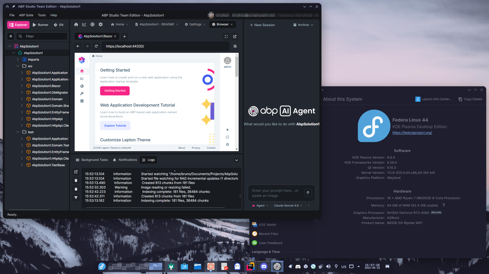

# ABP Studio for Linux

Unofficial Linux installer for [ABP Studio](https://abp.io/studio).

> [!IMPORTANT]
> This is an unofficial community project. It is not affiliated with, endorsed by, or supported by Volosoft.
>
> This repository does not redistribute ABP Studio. It only automates downloading ABP Studio from official ABP/Volosoft sources, then converting, packaging, and installing it locally.
>
> ABP Studio is proprietary software owned by Volosoft. Use of ABP Studio remains subject to Volosoft's [EULA](https://abp.io/eula). Do not redistribute generated packages, extracted ABP Studio files, or any other Volosoft proprietary content. Generated packages are intended only for personal or internal use by properly licensed users.
>
> This project is licensed under the MIT License and provided “as is,” without warranty or guaranteed support. Use at your own risk.



## Supported Systems

I have not tested extensively, but it should work on:

| Systems/package ecosystem (x86_64) | Package built  |
|------------------------------------|----------------|
| Debian, Ubuntu, Mint, Pop!_OS, etc | `.deb`         |
| Fedora, RHEL, openSUSE, etc        | `.rpm`         |
| Arch, CachyOS, EndeavourOS, etc    | `.pkg.tar.*`   |

## How To Install

### Make sure you have the following installed:

- [.NET SDK 10.x](https://learn.microsoft.com/en-us/dotnet/core/install/linux)
- [Node.js 20.11 or newer](https://nodejs.org/en/download)

### Clone the repository and run the installer:

```bash
git clone https://github.com/bgmulinari/abp-studio-linux.git
cd abp-studio-linux
./install.sh
```

The installer may use `sudo` to install required system packages and the generated native package.

### Launch ABP Studio:

Run the `abp-studio` command or open ABP Studio from your application launcher.

### Common optional arguments:

- `./install.sh --version <version>` installs a specific ABP Studio and ABP CLI version. Default is latest.
- `./install.sh --no-install` builds the native package without installing it.
- `./install.sh --force` reinstalls even when the target ABP Studio version is already installed.
- `./install.sh --fresh` removes generated output before starting.
- `./install.sh -y` passes non-interactive confirmation to package managers.

Run `./install.sh --help` to see all options.

## How It Works

The installer:

1. Checks your local .NET SDK and Node.js versions.
2. Installs required build/package tools, `mkcert`, and WireGuard tools.
3. Installs or updates the [ABP CLI](https://www.nuget.org/packages/Volo.Abp.Studio.Cli), using that version as the ABP Studio version to download.
4. Downloads the official ABP Studio package for macOS Intel.
5. Converts the app into `output/abp-studio-app/` with the matching app-local Linux .NET SDK/runtime.
6. Builds and installs the native package for your distro.

The installed native package provides:

- `/usr/bin/abp-studio`
- `/opt/abp-studio`
- `/opt/abp-studio/dotnet`

Generated files, native packages, work directories, and logs are written under `output/`. This directory can be removed after installation.
